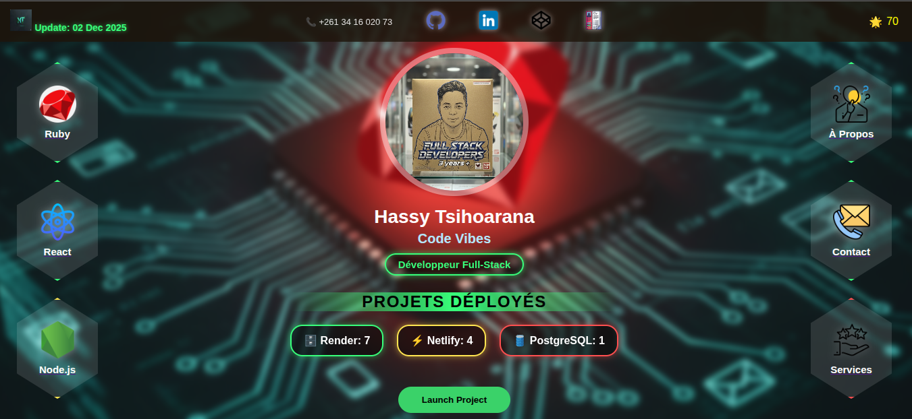
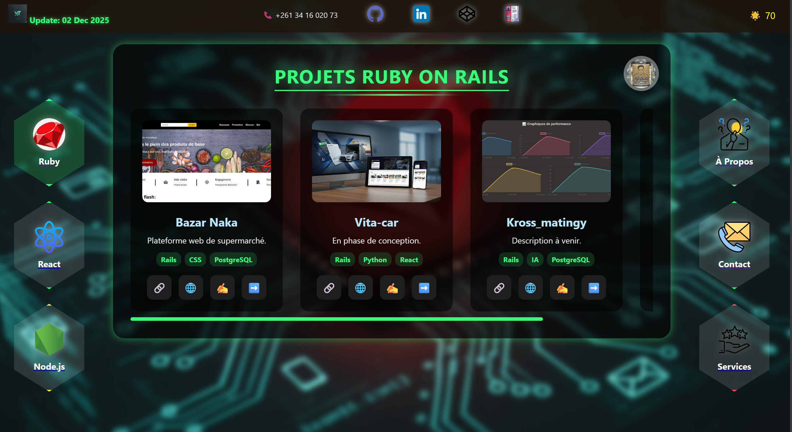

# RealTimeX ⚡

Hassy's Portfolio est un portfolio personnel construit avec **Node.js**,
**Express.js** et **EJS**.\
Il met en avant mes projets, compétences et propose un formulaire de
contact pour échanger avec moi.

------------------------------------------------------------------------

## 🚀 Features

-   📃 Affichage de mes informations personnelles et professionnelles.\
-   🖥️ Portfolio présentant mes projets avec descriptions détaillées.\
-   ✉️ Formulaire de contact permettant d'envoyer un message directement
    par email.\
-   🎨 Design simple, propre et fluide pour une expérience agréable.

------------------------------------------------------------------------

## 🖼️ Captures d'écran

### 🏠 Page d'accueil



### 🧩 Interface générale



------------------------------------------------------------------------

## 📦 Installation

1.  **Cloner le repository :**

    ``` bash
    git clone git@github.com:Hassyunity/node-fols.git
    cd node-fols
    ```

2.  **Installer les dépendances :**

    ``` bash
    npm install
    ```

3.  **Démarrer le serveur :**

    ``` bash
    npm start
    ```

------------------------------------------------------------------------

## 🚀 Déploiement sur Render

------------------------------------------------------------------------

## 🖥️ Technologies utilisées

-   Node.js\
-   Express.js\
-   EJS\
-   HTML / CSS / JavaScript\

------------------------------------------------------------------------

## C'etait Hassy Tsihoarana

